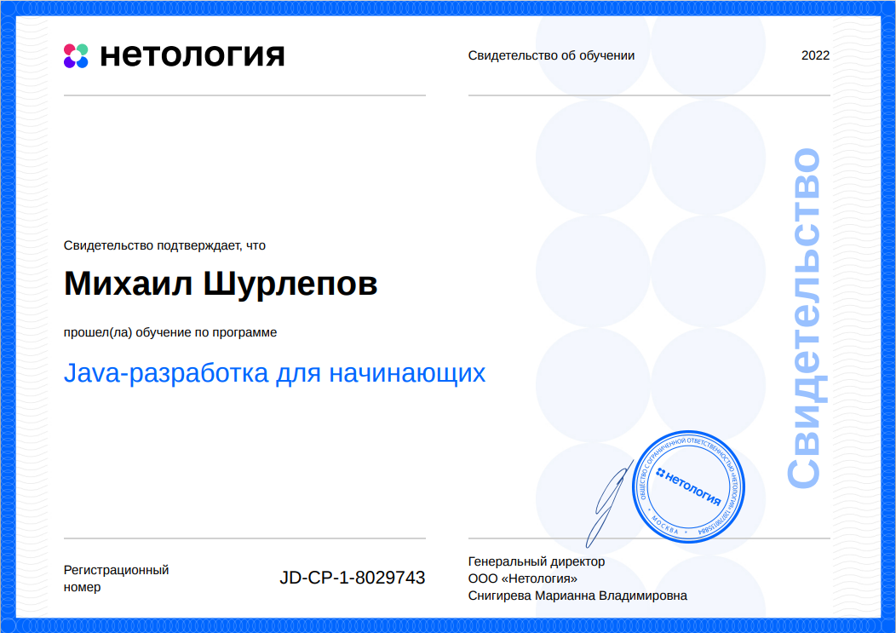

Репозиторий с задачами по Java, выполненными мной в рамках обучения в Нетологии.

**Список задач:**

A. Основы Java
1. [Введение в программирование на Java](src/Java_basics/Java_initial)
2. [Структура программы](src/Java_basics/Program_structure)
3. [Условные операторы и циклы](src/Java_basics/Operators_and_loops)
4. Типы данных в Java: примитивы
5. Типы данных в Java: объекты
6. Структура класса
7. Массивы одномерные
8. Массивы многомерные
9. Модификаторы доступа, наследование
10. Полиморфизм
11. Абстракции и интерфейсы
12. Исключения, Stacktrace

B. Основы Git и Java
1. Внедрение системы контроля версий
2. История работы и ветки
3. Командная работа
4. Generics в коллекциях и методах
5. Коллекции List
6. Коллекции Queue
7. Коллекции HashSet и HashMap
8. Коллекции TreeSet и TreeMap

C. Java Core
1. Лямбда-выражения и функциональные интерфейсы
2. Stream API. Потоки, повторные вызовы, основные методы
3. Потоки ввода-вывода. Работа с файлами. Сериализация.
4. Сборка проектов. Maven и Gradle
5. Работа с файлами csv, xml, json
6. Тестирование кода и Unit-тесты
7. Mockito. Мокитирование вызовов, Mock
8. Основы работы с сетью. Модель OSI, TCP, UDP
9. Протокол HTTP. Вызов удаленных серверов
10. JVM. Организация памяти, сборщики мусора, VisualVM

D. Шаблоны проектирования
1. Порождающие шаблоны. Builder, Singleton, Factory method, Abstract factory, Prototype
2. Структурные шаблоны. Proxy, Decorator, Adapter
3. Поведенческие шаблоны. Command, Iterator, Observer, Chain of responsibility
4. Свойства хорошего кода и принцип SOLID

**Курсовые проекты:**
1. Конвертер в текстовую графику
2. Менеджер личных финансов
3. Менеджер задач

**Дипломный проект:**
- Поисковая система

**Сертификат об успешном окончании курса:**

