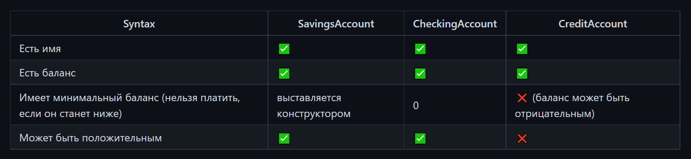

### Задание
Вы пишете систему из классов, описывающую банковские счета. Все классы кроме `Main` должны быть в пакете `accounts`.

У каждого счёта есть баланс (`long`) и имя владельца (`String`). У каждого счёта есть две операции: оплатить (`pay(long amount)`) и пополнить (`add(long amount)`); в параметрах передаётся сумму покупки или пополнения соответственно. Каждая операция должна возвращать `boolean` о том, успешно ли она прошла. Никакого вывода на экран никакая операция не должна производить.

Также есть три вида счёта: накопительный (`SavingsAccount`), расчётный (`CheckingAccount`) и кредитный (`CreditAccount`).

У вас должен быть класс `Account`, который является родителем для всех трёх классов-видов аккаунтов. В нём должно быть два метода (`pay` и `add`). И три класса-наследника, по одному для каждого типа счёта. Подумайте, какие поля они должны будут иметь.

В `Main` продемонстрируйте работу ваших классов (с пользователем общаться необязательно).

Подсказки
Создайте класс `Account` с двумя методами, общими для всех счетов данными в виде полей и конструктором для заполнения этих полей.

Создайте трёх наследников. У `SavingsAccount` появится ещё один параметр конструктора, которым будет задаваться минимальный баланс. Переопределите в наследниках методы операций над счётом, чья логика отличается между типами счёта.

Не забудьте про инкапсуляцию!